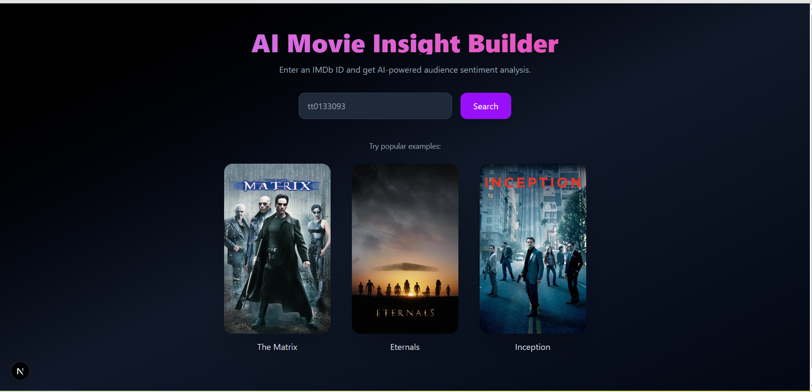
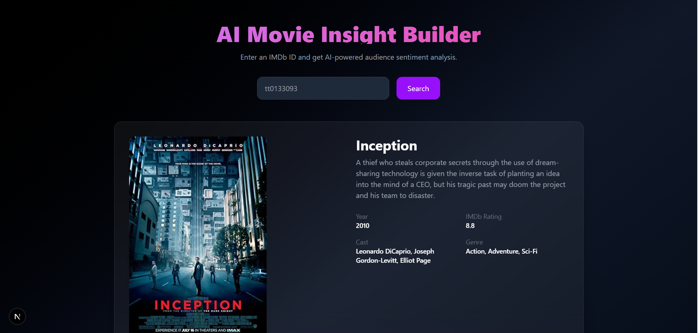
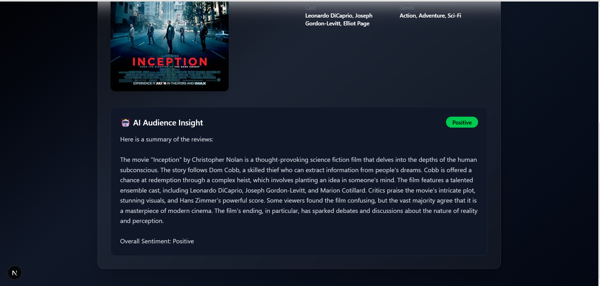

# 🎬 AI Movie Insight Builder

An AI-powered full-stack movie analysis application built with Next.js.  
Enter an IMDb ID to fetch movie details and get AI-generated audience sentiment insights.

---

## 🌐 Live Demo

🔗 https://your-vercel-link.vercel.app


---

## 🚀 Project Overview

This project was developed as part of a Full-Stack Developer assessment.

The application:

- Fetches movie metadata using IMDb ID
- Retrieves audience reviews from TMDB
- Uses Google Gemini AI to summarize audience sentiment
- Classifies overall sentiment (Positive / Mixed / Negative)
- Displays structured insights in a modern, responsive UI

---

## 🛠 Tech Stack

### Frontend
- Next.js (App Router)
- TypeScript
- Tailwind CSS
- Framer Motion (UI animations)

### Backend (API Routes)
- Next.js API Routes
- Node.js runtime

### External APIs
- **OMDb API** – Movie metadata
- **TMDB API** – Audience reviews
- **Google Gemini API** – AI summarization & sentiment analysis

### Testing
- Jest (Unit testing)

---

## ✨ Core Features

- 🔎 IMDb Movie ID input
- 🎞 Movie title & poster
- 👥 Cast list
- 📅 Release year
- ⭐ IMDb rating
- 📖 Plot summary
- 📝 Audience review retrieval
- 🤖 AI-generated sentiment summary
- 📊 Sentiment classification badge (Positive / Mixed / Negative)
- ⚠ IMDb ID format validation
- ❌ Graceful error handling
- 📱 Fully responsive UI
- 🎨 Modern premium design with smooth animations

---

## 🏗 Architecture Overview

1. User enters an IMDb ID.
2. Frontend calls `/api/movie` to fetch movie data from OMDb.
3. Frontend calls `/api/reviews` to retrieve audience reviews from TMDB.
4. Reviews are sent to `/api/sentiment`.
5. Google Gemini API analyzes reviews and returns:
   - A short structured summary
   - Overall sentiment classification
6. UI renders the sentiment badge and AI-generated summary.

---

## 🧪 Validation & Testing

Basic unit testing implemented using Jest.

### IMDb ID Validation
- Valid format: `tt` + 7–8 digits
- Invalid format handling

Run tests:

```bash
npm run test
```

---

## 📸 Screenshots

### 🏠 Home Page


### 🎬 Movie Details & Sentiment Analysis



---

## 🖥 Local Setup & Installation

Follow the steps below to run the project locally:

```bash
# Clone the repository
git clone <your-repository-url>
cd ai-movie-insight

# Install dependencies
npm install
```

Create a file named `.env.local` in the root directory and add:

```
OMDB_API_KEY=your_omdb_key
NEXT_PUBLIC_TMDB_API_KEY=your_tmdb_key
GEMINI_API_KEY=your_gemini_key
```

Then start the development server:

```bash
npm run dev
```

App will run at:
```
http://localhost:3000
```

---

## ⚠ Environment Variables Notice

- Do NOT commit `.env.local`
- Keep all API keys private
- Production deployment must configure environment variables securely

---

## ⚠ Known Limitations

- Free-tier Gemini API has daily request limits
- Sentiment accuracy depends on review availability
- Some movies may have limited or no audience reviews
- AI responses may vary slightly due to model behavior

---

## 📌 Submission Notes

- Fully functional full-stack application
- Clean modular code structure
- AI integration with structured sentiment classification
- Responsive and production-ready UI
- Basic unit testing included

---

## 👨‍💻 Author

Developed as part of a Full-Stack Developer Internship Assessment.